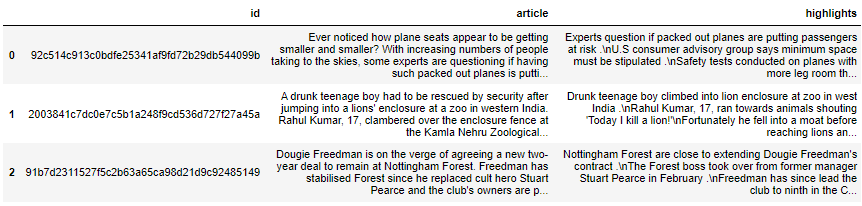
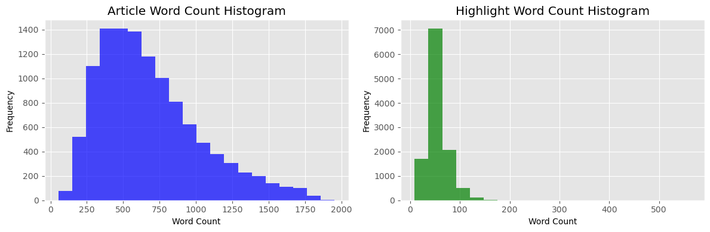
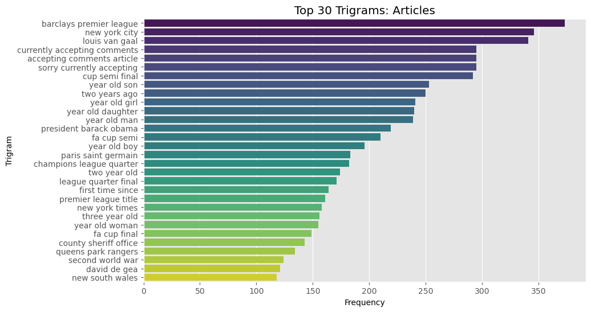
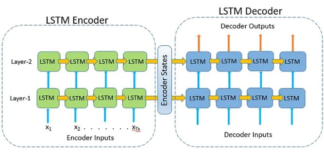
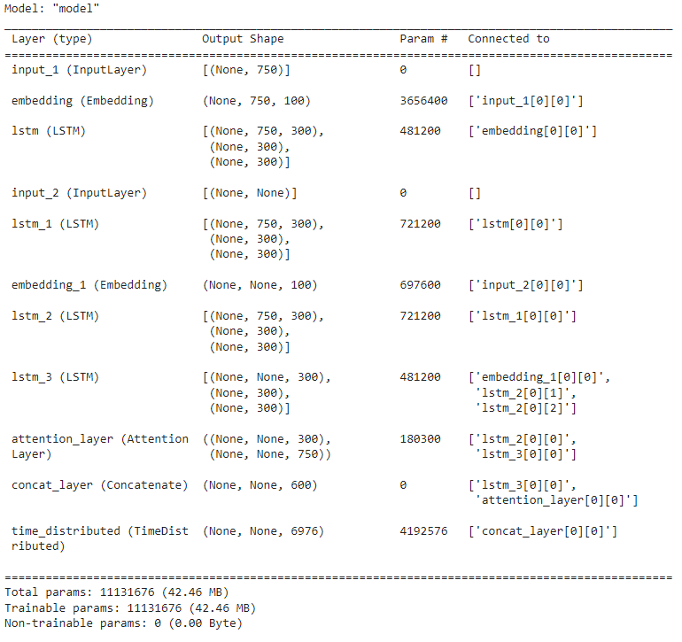
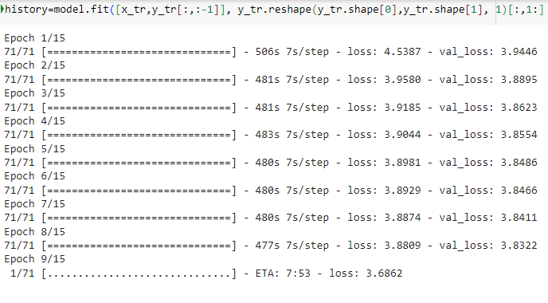
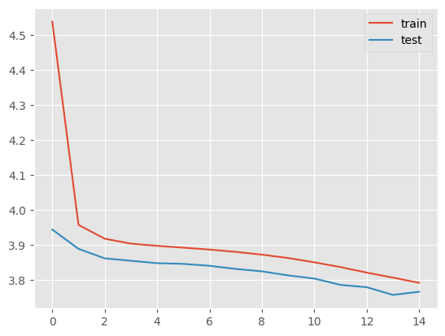
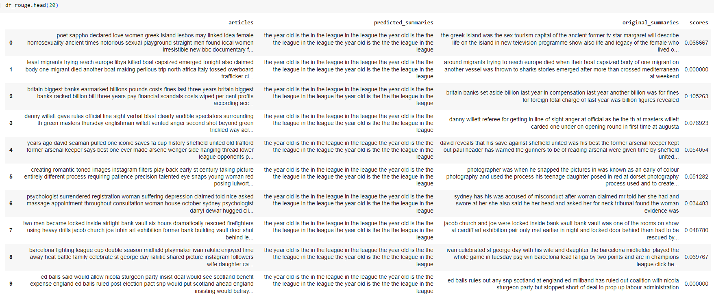
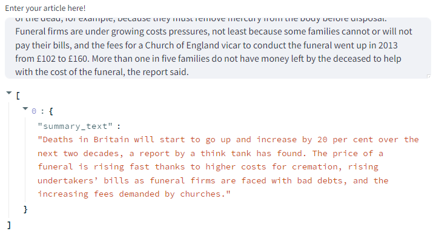

# Phase 5 Project - Fast Tracking Media Intelligence


## Natural Language Processing Model for Text Summarization of CNN Daily News articles

Name: Andrew Levinton
Student Pace: Self Pace
Instructor name: Ahbhineet Kukarni

# Business Problem

In this study, we will be analyzing CNN-Daily Mail News Articles. Many companies want to keep track of the latest news trends and reading full length articles can be incredibly time consuming. With the way news headlines affect major business decisions such as legal matters and stock prices, its important that readers are able to obtain all the information and reasoning behind the purpose of these articles and many of them can have a large number of distractors. It's essential that companies that get this information have the ability to quickly analyze these articles and develop counter intel or reports of their own in order to stay current and relevant with today's media. In this study we take the first steps towards utilizing text summarization to fast track the information gathering and counter-reporting process. 


# Business Understanding

## Description:

In today's information age, staying updated with news and information is crucial for both individuals and businesses. However, the sheer volume of news articles published daily can be overwhelming. Reading and processing these articles is time-consuming, especially when trying to gather insights from multiple sources.

To address this challenge, we propose the development of a text summarization model using natural language processing (NLP) techniques. This model will automatically generate concise and coherent summaries of news articles. Here's how it can benefit the public and support business decisions:

1. `Time Efficiency`: People often struggle to find the time to read lengthy news articles. Automated summarization allows individuals to quickly grasp the key points of an article, saving them time while keeping them informed.

2. `Enhanced Understanding`: Summaries provide a condensed version of the article, making complex topics more accessible to a wider audience. This can help people better understand important news and events.

3. `Multi-source Insights`: Readers can efficiently scan summaries from multiple sources to get a well-rounded view of a topic, fostering critical thinking and a broader perspective.

4. `Competitive Intelligence`: Businesses can use automated summarization to track news and developments in their industry, enabling them to stay ahead of competitors and adapt to market changes more effectively.

5. `Market Research`: Summarization can assist in analyzing customer sentiment, emerging trends, and competitor strategies by summarizing customer reviews, news, and social media posts.

6. `Content Curation`: Media companies and content aggregators can use summarization to curate content for their audience, improving user engagement and retention.


### Goals of this study:

1. Streamline and automate the understanding of complex news topics. 
2. Help track news developments to enhance market research.

### Business Questions to consider:

- What specific NLP techniques or models can be employed to automate the process of summarizing complex news articles effectively?
- How can automation be leveraged to provide real-time updates on important news developments to users or clients?
- Are there opportunities to use automation to personalize news content delivery based on individual user preferences and interests?
- How can automated summarization and analysis be integrated into other tools or platforms, such as news aggregators or chatbots?
- What are the critical news sources, categories, or keywords that have the most significant impact on market trends and consumer sentiment?

We will be using the CNN-Daily Mail News dataset to conduct our study. You can download the dataset from [here](https://www.kaggle.com/datasets/gowrishankarp/newspaper-text-summarization-cnn-dailymail)

# I. Data Understanding
The CNN / DailyMail Dataset is an English-language dataset containing just over 300k unique news articles as written by journalists at CNN and the Daily Mail. The current version supports both extractive and abstractive summarization, though the original version was created for machine reading and comprehension and abstractive question answering.

The columns of the dataframe are:
1. `ID`- Unique ID of the article
2. `article` - The raw content of the article
3. `Highlights` - A summary of the article

# Preview of dataframe



## Sample Article and reference summary

### Article:
"Cristiano Ronaldo and Lionel Messi will go head-to-head once more in the race to be this season's top scorer in the Champions League – although Luiz Adriano threatens to spoil the party. Both Barcelona and Real Madrid booked their spots in the semi-finals this week with victories over Paris Saint-Germain and Atletico Madrid respectively. The planet's best footballers have scored eight times in Europe this season. But Shakhtar Donetsk’s Adriano, courted by Arsenal and Liverpool, has netted on nine occasions this term. Cristiano Ronaldo, in action against Atletico Madrid on Wednesday evening, has scored eight goals in Europe . Lionel Messi also has eight goals in the Champions League this term; one fewer than Luiz Adriano . Ronaldo and Messi will both play at least two more times after Real Madrid and Barcelona reached the last four . Adriano, who moved to Donetsk in 2007, scored five against BATE Borsiov in the group stages. His performance that night made history, with the 27-year-old becoming only the second player to score five times in a Champions League game. The other was Messi for Barcelona against Bayer Leverkusen in 2012. He also scored the third quickest hat-trick in the competition's history (12 minutes) as the Ukrainian side, knocked out by Bayern Munich in the round of 16, racked up the biggest-ever half-time lead (6-0) in Europe's premier tournament. ‘I am in a good moment of my career and we'll do what will be best for me and for the club,’ said Adriano last month when quizzed over his future. Adriano, who netted five times against BATE Borisov in the group, has scored more goals than any other player in the Champions League... he is out of contract in December and could move to the Premier League . ‘With my contract set to expire and many good performances, it'll be difficult to stay in Ukraine.’ Arsenal have sent scouts to watch Adriano in recent months, while Liverpool are also keen on the Brazilian. His contract with Shakhtar Donetsk runs out at the end of the year. Ronaldo and Messi however, remain in pole-position to top the scoring charts with Barcelona and Real Madrid both in the hat for the two-legged semi-finals to be played next month. Of the teams still in the pot, Neymar and Luis Suarez of Barcelona, Real Madrid's Karim Benzema and former Manchester United and City striker Carlos Tevez, now plying his trade for Juventus, each have six goals. The draw for the last four will take place on Friday."

### Reference Summary:

"Luiz Adriano scored nine times for Shakhtar Donetsk in Europe this season .\nThe Brazilian is out of contract at the end of the year... both Arsenal and Liverpool are interested in signing the 27-year-old .\nCristiano Ronaldo and Lionel Messi have netted eight goals this season .\nReal Madrid and Barcelona both in the Champions League semi-finals .\nREAD: Our reporters have their say on who will win the Champions League .\nCLICK HERE for Sportsmail's guide to the Champions League final four ."


-The reference summary provided for the sample article appears to be a good representation of the article from a business case perspective for a text summarization model **aiming to extract key information from news articles**. Here's why its a good benchmark for achievement of our model:

- `Key Information Extraction`: The reference summary effectively extracts and condenses the most important information from the article. It mentions the number of goals scored by Luiz Adriano and the interest from Arsenal and Liverpool. It also highlights the goal tally of Cristiano Ronaldo and Lionel Messi, as well as the fact that both Real Madrid and Barcelona are in the Champions League semi-finals. This information encapsulates the main points of interest in the article.

- `Conciseness`: The reference summary is concise and to the point. It does not contain unnecessary details or filler content, which is crucial for generating news feed content and trends analysis where brevity is key.

- `Relevance`: The reference summary includes information that is directly relevant to the business case, such as the goals scored, contract status, and the interest of major football clubs. This relevance is essential for providing valuable insights.

- `Structure`: The summary is well-structured, with bullet points that make it easy to skim and understand the main points quickly. This is important for generating news feed content that needs to be quickly digestible.

- `Clarity`: The language used in the reference summary is clear and easy to understand, ensuring that the extracted information is accessible to a broad audience.

# Understanding the distribution of the sequences
Here, we will analyze the length of the reviews and the summary to get an overall idea about the distribution of length of the text. This will help us fix the maximum length of the sequence:



The average token count for the articles and the highlights are provided below:


| Feature      | Mean Token Count |
|--------------|------------------|
| Article      | 683              |
| Highlights   | 55               |


# III. Data Preparation

Performing basic preprocessing steps is very important before we get to the model building part. Using messy and uncleaned text data is a potentially disastrous move. So in this step, we will drop all the unwanted symbols, characters, etc. from the text that do not affect the objective of our problem.

Here is the dictionary that we will use for expanding the contractions:

## Contraction Mapping
A contraction mapping, also known as a "contraction operator" or "contraction function," is a concept from mathematics, specifically in the field of functional analysis. In the context of text summarization, it's not directly used, but related concepts and techniques from mathematics and natural language processing can be applied to improve the quality of text summarization models.
Contraction Mapping was utilized in our **2nd Iteration** of the modeling process, but not in this notebook. The concept of contraction mapping was used here just as a demonstration of how it was used in the actual model.

### Here is a snapshot of what contraction mapping looks like:
### {"ain't": "is not", "aren't": "are not","can't": "cannot", "'cause": "because"}

# Text Cleaning
The following steps were taken to preprocess the data for each of our models:

1. Convert everything to lowercase
2. Remove HTML tags
3. Contraction mapping
4. Remove (‘s)
5. Remove any text inside the parenthesis ( )
6. Eliminate punctuations and special characters
7. Remove stopwords
8. Remove short words

# Snapshot of cleaned text

### **Before Cleaning**
#### Ever noticed ~how~ plane seats appear ~to be~ getting smaller and smaller~?~ ~With~ increasing numbers ~of~ people taking ~to the~ skies~,~ ~some~ experts ~are~ questioning ~if having such~ packed ~out~ planes ~is~ putting passengers ~at~ risk~. They~ say ~that~ ~the~ shrinking space ~on~ aeroplanes ~is not only~ uncomfortable ~- it's~ putting ~our~ health ~and~ safety ~in~ danger~. More than~ squabbling over ~the~ arm rest~,~ shrinking space ~on~ planes putting ~our~ health ~and~ safety ~in~ danger~?~ This week~, a~ U.S consumer advisory group ~set up by the~ 

### **After Cleaning**
#### ever noticed plane seats appear getting smaller smaller increasing numbers people taking skies experts questioning packed planes putting passengers risk say shrinking space aeroplanes uncomfortable putting health safety danger squabbling arm rest shrinking space planes putting health safety danger week consumer advisory group

## Sample cleaned article

#### Article:
drunk teenage boy rescued security jumping lions enclosure zoo western india rahul kumar clambered enclosure fence kamla nehru zoological park ahmedabad began running towards animals shouting would kill mr kumar explained afterwards drunk thought would stand good chance predators next level drunk intoxicated rahul kumar climbed lions enclosure zoo ahmedabad began running towards animals shouting today kill lion mr kumar sitting near enclosure suddenly made dash lions surprising zoo security intoxicated teenager ran towards lions shouting today kill lion lion kills zoo spokesman said guards earlier spotted close enclosure idea planing enter fortunately eight moats cross getting lions usually fell second one allowing guards catch take handed police brave fool fortunately mr kumar fell moat ran towards lions could rescued zoo security staff reaching animals kumar later explained really know drunk thought would stand good chance police spokesman said cautioned sent psychiatric evaluation fortunately lions asleep zoo guards acted quickly enough prevent tragedy similar delhi last year year old man mauled death tiger indian capital climbing enclosure city zoo

## Sample cleaned highlight

experts question if packed out planes are putting passengers at risk consumer advisory group says minimum space must be stipulated safety tests conducted on planes with more leg room than airlines offer

# N-grams: Articles




As shown in the n-grams, we obtain a lot of good information about the articles. Here, we can see that the n-grams indicate that the articles cover topics such as Soccer, US politics and Current Events. 

# IV. Model building

# Baseline - TFIDF Vectorizer 

[TFIDF](https://medium.com/@ashins1997/text-summarization-f2542bc6a167#:~:text=Sentence%20scoring%20using%20tf%2Didf,word%20occurs%20in%20the%20document.)

### Sentence scoring using tf-idf is one of the extractive approaches for text summarization.

`In TF-IDF (Term Frequency-Inverse Document Frequency)` text summarization, sentence scoring involves evaluating the importance of each sentence in a document. It does this by considering the frequency of words in the sentence (Term Frequency) and the uniqueness of those words across the entire document collection (Inverse Document Frequency). Sentences containing rare and important terms receive higher scores, making them more likely to be included in the summary. This aids in text summarization by selecting sentences that capture the key concepts and information, resulting in a concise and informative summary.
- **TF-IDF stands for Term Frequency** — Inverse Document Frequency. It is the product of two statistics.

- **Term Frequency (TF)** : It is the number of times the word occurs in the document.
- **Inverse Document Frequency (IDF)** : It is the measure of how much information the word provides, i.e., if it’s common or rare across all documents.

# Sample Summary

### Original Article: 
Cristiano Ronaldo and Lionel Messi will go head-to-head once more in the race to be this season's top scorer in the Champions League – although Luiz Adriano threatens to spoil the party. Both Barcelona and Real Madrid booked their spots in the semi-finals this week with victories over Paris Saint-Germain and Atletico Madrid respectively. The planet's best footballers have scored eight times in Europe this season. But Shakhtar Donetsk’s Adriano, courted by Arsenal and Liverpool, has netted on nine occasions this term. Cristiano Ronaldo, in action against Atletico Madrid on Wednesday evening, has scored eight goals in Europe . Lionel Messi also has eight goals in the Champions League this term; one fewer than Luiz Adriano . Ronaldo and Messi will both play at least two more times after Real Madrid and Barcelona reached the last four . Adriano, who moved to Donetsk in 2007, scored five against BATE Borsiov in the group stages. His performance that night made history, with the 27-year-old becoming only the second player to score five times in a Champions League game. The other was Messi for Barcelona against Bayer Leverkusen in 2012. He also scored the third quickest hat-trick in the competition's history (12 minutes) as the Ukrainian side, knocked out by Bayern Munich in the round of 16, racked up the biggest-ever half-time lead (6-0) in Europe's premier tournament. ‘I am in a good moment of my career and we'll do what will be best for me and for the club,’ said Adriano last month when quizzed over his future. Adriano, who netted five times against BATE Borisov in the group, has scored more goals than any other player in the Champions League... he is out of contract in December and could move to the Premier League . ‘With my contract set to expire and many good performances, it'll be difficult to stay in Ukraine.’ Arsenal have sent scouts to watch Adriano in recent months, while Liverpool are also keen on the Brazilian. His contract with Shakhtar Donetsk runs out at the end of the year. Ronaldo and Messi however, remain in pole-position to top the scoring charts with Barcelona and Real Madrid both in the hat for the two-legged semi-finals to be played next month. Of the teams still in the pot, Neymar and Luis Suarez of Barcelona, Real Madrid's Karim Benzema and former Manchester United and City striker Carlos Tevez, now plying his trade for Juventus, each have six goals. The draw for the last four will take place on Friday.


### Predicted Summary: 
Cristiano Ronaldo and Lionel Messi will go head-to-head once more in the race to be this season's top scorer in the Champions League – although Luiz Adriano threatens to spoil the party. The planet's best footballers have scored eight times in Europe this season. Cristiano Ronaldo, in action against Atletico Madrid on Wednesday evening, has scored eight goals in Europe . Adriano, who moved to Donetsk in 2007, scored five against BATE Borsiov in the group stages. The other was Messi for Barcelona against Bayer Leverkusen in 2012. His contract with Shakhtar Donetsk runs out at the end of the year. The draw for the last four will take place on Friday. 


### Original Summary: 
Luiz Adriano scored nine times for Shakhtar Donetsk in Europe this season .
The Brazilian is out of contract at the end of the year... both Arsenal and Liverpool are interested in signing the 27-year-old .
Cristiano Ronaldo and Lionel Messi have netted eight goals this season .
Real Madrid and Barcelona both in the Champions League semi-finals .
READ: Our reporters have their say on who will win the Champions League .
CLICK HERE for Sportsmail's guide to the Champions League final four .

## Article was summarized from 18 sentences down to 7. 

## Model Evaluation - Rouge Score

ROUGE (Recall-Oriented Understudy for Gisting Evaluation) is a set of metrics used for evaluating the quality of text summarization and machine translation. These metrics assess the similarity between the generated summary and one or more reference summaries (human-written) to measure the performance of automatic summarization systems. The primary focus of ROUGE metrics is on content overlap and the ability of a system to capture the essential information from the source text.


# Rouge-l Recall
ROUGE-L recall is a critical metric in text summarization evaluation because it places a strong emphasis on capturing the longest common subsequence between the generated summary and the reference summary. This is particularly valuable because it:

- Assesses Content Overlap: ROUGE-L recall evaluates how well the generated summary captures the most important content from the reference summary. It ensures that the key information in the original text is retained in the summary.

- Considers Sequencing: It takes into account the order in which words appear in the summaries. This means that not only should the same words be present, but they should also be arranged in a coherent and logical sequence.

- Emphasizes Quality: ROUGE-L recall prioritizes the quality of the summary over its length. It encourages the generation of concise summaries that faithfully represent the source text's essential information.

- Sensitive to Substantial Content: Longer common subsequences are more likely to represent significant content. ROUGE-L recall ensures that the most vital parts of the text are included in the summary, helping to maintain its informativeness.

- Performance Assessment: In the context of summarization, evaluating recall is crucial because it measures how well the system remembers and includes critical information. This is a fundamental aspect of evaluating the overall effectiveness of a summary.

In essence, ROUGE-L recall is a vital metric in text summarization as it assesses content fidelity, structure, and the ability to capture essential information, aligning well with the objectives of text summarization.

## Analysis - Recall
Measures the proportion of relevant information that our summarization model successfully captures from the source articles and presents in the generated summaries. 

In our business case, a higher recall score indicates that our model is effective at retrieving and including important content from news articles in the summaries. 


This is crucial as it ensures that readers and businesses are well-informed and that the generated summaries are a valuable source of information.
Interpretation:

- ROUGE-L Recall Score (0.3002): The ROUGE-L Recall score of 0.3002 indicates that our summarization model captures approximately 30.02% of the content present in the reference "highlights." This signifies that TFIDF model is fairly effective at recalling important content from the reference summaries.


# Iteration 2 - Seq2Seq (Run in Google Colab)
The next iteration of modeling that was deployed was an RNN Seq2Seq Model using google colab. The use of google colab was necessary due to the high RAM needs of running the model itself. Here is a description of the modeling process that was used in the notebook:

### Attention Layer
An attention layer is a critical component in modern neural network architectures, particularly in sequence-to-sequence models, and it plays a fundamental role in enhancing the model's ability to focus on specific parts of input data. Here's an explanation of the concept of an attention layer:

1. Purpose of Attention: The primary purpose of an attention layer is to enable a neural network to "pay attention" to different parts of the input sequence when making predictions. It allows the model to assign varying degrees of importance or relevance to different elements in the input sequence.

2. Sequences and Alignment: Attention layers are commonly used in tasks involving sequences, such as machine translation, text summarization, and speech recognition. When processing sequences, it's important to consider the alignment between the elements of the input and output sequences. The attention mechanism helps in aligning these sequences.

3. Mechanism: The attention mechanism works by computing a weighted sum of the elements in the input sequence, where the weights are dynamically determined based on the context of the current decoding step. In other words, it identifies which parts of the input sequence are most relevant for generating the current output.

4. Calculation of Attention Weights: Attention weights are calculated by comparing the current state of the model (decoder) to each element in the input sequence. These comparisons are often performed using a similarity function, such as dot product or cosine similarity. The results are then transformed into probabilities using a softmax function, making them sum to 1.

### Benefits:

- Enhanced Performance: Attention mechanisms have significantly improved the performance of sequence-to-sequence models in various NLP tasks.
- Handling Variable-Length Sequences: Attention allows the model to handle input sequences of variable length and generate output sequences of varying length.
- Improved Interpretability: Attention mechanisms provide insights into which parts of the input data are influential in making specific predictions.


A Seq2Seq (Sequence-to-Sequence) model is a type of neural network architecture designed for various natural language processing (NLP) tasks, including text summarization. The primary purpose of a Seq2Seq model is to transform input sequences into output sequences of varying lengths. In the context of text summarization, it's used to convert long articles or documents into shorter, coherent summaries. 

Here's an overview of the steps involved in preparing, building, and deploying a Seq2Seq model for encoder-decoder text summarization:


###  Building the Seq2Seq Model - 3 Stacked LSTM

Lets first have a look at a visual of how an LSTM model looks:



Some important terminologies

- `Return Sequences = True`: When the return sequences parameter is set to True, LSTM produces the hidden state and cell state for every timestep
- `Return State = True`: When return state = True, LSTM produces the hidden state and cell state of the last timestep only
- `Initial State`: This is used to initialize the internal states of the LSTM for the first timestep
- `latent_dim`: It denotes the number of hidden units.

The model took over 2 hours to run and was done in google colab due to the high RAM demand. Here is a snapshot of the model summary:




And here is a snapshot of the model being compiled:







# Accessing the Notebook

- Due to the absurdly high GPU demand, the RNN model was run in google colab with the help of GPU runtime. 

Access the notebook [here](https://colab.research.google.com/drive/11kJO7o52TKAnjS2fnDLYp4TWvwXJLRQ_?usp=sharing) and make a copy if you wish to use the notebook. 


***WARNING*** this notebook requires a high demand of RAM to run and likely will crash if you do not have RAM up to 40GB. Please just view the notebook if you do not have the processing power to do so.

# Results


Original summary: around migrants trying to reach europe died when their boat capsized body of one migrant on another vessel was thrown to sharks stories emerged after more than crossed mediterranean at weekend 

Predicted summary: the year old is the in the league in the league the year old is the the the league in the league the year old is the the the league in the league

Mean Rouge Score-l recall: 0.06058139110770686

As you can see above, the model performed poorly, producing incoherent text that failed to provide any sort of summary to the article. The Rouge score indicates that there is virtually no overlap to the article. 

Unfortunately, the model performed as poorly on all the articles and will require some serious fine tuning for improvement. Due to time constraint, and the knowledge of so many state of the art premade models out there, I decided to pivot to what ends up being my final model. 


## Moving forward
Since we do not forsee ourselves building a model that will match the "state of the art" models that are already built for this task, we will switch to a fine-tuned model that we can pull from huggingface. 

# Final Model - BART out of the box model

Click [here](https://huggingface.co/facebook/bart-large-cnn) for the link to the BART model

## BART (large-sized model), fine-tuned on CNN Daily Mail
BART model pre-trained on English language, and fine-tuned on CNN Daily Mail. It was introduced in the paper BART: Denoising Sequence-to-Sequence Pre-training for Natural Language Generation, Translation, and Comprehension by Lewis et al. and first released in [this repository](https://github.com/pytorch/fairseq/tree/master/examples/bart).

## Model description
- BART is a transformer encoder-encoder (seq2seq) model with a bidirectional (BERT-like) encoder and an autoregressive (GPT-like) decoder. BART is pre-trained by 
- (1) corrupting text with an arbitrary noising function
- (2) learning a model to reconstruct the original text.

- BART is particularly effective when fine-tuned for text generation (e.g. summarization, translation) but also works well for comprehension tasks (e.g. text classification, question answering). This particular checkpoint has been fine-tuned on CNN Daily Mail, a large collection of text-summary pairs.


#### Original Article

A drunk teenage boy had to be rescued by security after jumping into a
lions' enclosure at a zoo in western India.  Rahul Kumar, 17,
clambered over the enclosure fence at the Kamla Nehru Zoological Park
in Ahmedabad, and began running towards the animals, shouting he would
'kill them'. Mr Kumar explained afterwards that he was drunk and
'thought I'd stand a good chance' against the predators.  Next level
drunk: Intoxicated Rahul Kumar, 17, climbed into the lions' enclosure
at a zoo in Ahmedabad and began running towards the animals shouting
'Today I kill a lion!'  Mr Kumar had been sitting near the enclosure
when he suddenly made a dash for the lions, surprising zoo security.
The intoxicated teenager ran towards the lions, shouting: 'Today I
kill a lion or a lion kills me!'  A zoo spokesman said: 'Guards had
earlier spotted him close to the enclosure but had no idea he was
planing to enter it.  'Fortunately, there are eight moats to cross
before getting to where the lions usually are and he fell into the
second one, allowing guards to catch up with him and take him out.
'We then handed him over to the police.'  Brave fool: Fortunately, Mr
Kumar  fell into a moat as he ran towards the lions and could be
rescued by zoo security staff before reaching the animals (stock
image) Kumar later explained: 'I don't really know why I did it.  'I
was drunk and thought I'd stand a good chance.'  A police spokesman
said: 'He has been cautioned and will be sent for psychiatric
evaluation.  'Fortunately for him, the lions were asleep and the zoo
guards acted quickly enough to prevent a tragedy similar to that in
Delhi.'  Last year a 20-year-old man was mauled to death by a tiger in
the Indian capital after climbing into its enclosure at the city zoo.

#### Summary
"Rahul Kumar, 17, clambered over enclosure fence at\xa0Kamla Nehru Zoological Park. He ran towards the animals shouting 'Today I kill a lion or a lion kills me!' Fortunately, Mr Kumar fell into a moat and was rescued by zoo security. He has been cautioned and will be sent for psychiatric evaluation."

### Rouge Score: 0.6176470588235294

## Demonstrating model on six sample articles:

### Article 1
- **Predicted Summary:** 
U.S consumer advisory group set up by the Department of Transportation said that while the government is happy to set standards for animals flying on planes, it doesn't stipulate a minimum amount of space for humans. Tests conducted by the FAA use planes with a 31 inch pitch, a standard which on some airlines has decreased. Many economy seats on United Airlines have 30 inches of room, while some airlines offer as little as 28 inches.


- **Reference Summary:** 
Experts question if  packed out planes are putting passengers at risk .
U.S consumer advisory group says minimum space must be stipulated .
Safety tests conducted on planes with more leg room than airlines offer .


- ROUGE-L Score: 0.3939
This summary does not closely match the reference summary in terms of content and structure. It provides some information about a U.S. consumer advisory group and issues with seat space on planes, but it lacks key details present in the reference summary. The ROUGE-L score is relatively low, indicating poor recall and overlap with the reference summary.

### Article 2
- **Predicted Summary:** 
Rahul Kumar, 17, clambered over enclosure fence at Kamla Nehru Zoological Park. He ran towards the animals shouting 'Today I kill a lion or a lion kills me!' Fortunately, Mr Kumar fell into a moat and was rescued by zoo security. He has been cautioned and will be sent for psychiatric evaluation. Last year a 20-year-old man was mauled to death by a tiger in Delhi.


- **Reference Summary:** 
Drunk teenage boy climbed into lion enclosure at zoo in west India .
Rahul Kumar, 17, ran towards animals shouting 'Today I kill a lion!'
Fortunately he fell into a moat before reaching lions and was rescued .


- ROUGE-L Score: 0.6471
This summary is a better match to the reference summary, capturing the main incident involving a teenager at a zoo. The ROUGE-L score is relatively high, indicating good recall and overlap with the reference summary.


### Article 3
- **Predicted Summary:** 
Dougie Freedman is on the verge of agreeing a new two-year deal. Freedman has stabilised Forest since he replaced Stuart Pearce. Forest made an audacious attempt on the play-off places when Freedman replaced Pearce but have tailed off in recent weeks. That has not prevented Forest's ownership making moves to secure Freedman on a contract for the next two seasons.


- **Reference Summary:** 
Nottingham Forest are close to extending Dougie Freedman's contract .
The Forest boss took over from former manager Stuart Pearce in February .
Freedman has since lead the club to ninth in the Championship .


- ROUGE-L Score: 0.3929
This summary provides information about Dougie Freedman's contract extension but lacks some of the key details from the reference summary. The ROUGE-L score is relatively low, indicating poor recall and overlap with the reference summary.

### Article 4
- **Predicted Summary:** 
Fiorentina goalkeeper Neto is wanted by a number of top European clubs, according to his agent Stefano Castagna. Liverpool were linked with a move for the 25-year-old earlier in the season when Simon Mignolet was dropped from the side. A January move for Neto never materialised but the former Atletico Paranaense keeper looks certain to leave the Florence-based club in the summer.


- **Reference Summary:** 
Fiorentina goalkeeper Neto has been linked with Liverpool and Arsenal .
Neto joined Firoentina from Brazilian outfit Atletico Paranaense in 2011 .
He is also wanted by PSG and Spanish clubs, according to his agent .
CLICK HERE for the latest Liverpool news .


- ROUGE-L Score: 0.4865
This summary captures the main idea of Fiorentina goalkeeper Neto being wanted by European clubs but is slightly different from the reference summary. The ROUGE-L score suggests reasonable recall and overlap with the reference summary.
In summary, the model's performance varies across different examples. It performs reasonably well in some cases, closely matching the reference summary, but less accurately in others, leading to lower ROUGE-L scores. 


### Article 5
- **Predicted Summary:** 
The former Olympian and reality TV star, 65, will speak in a 'far-ranging' interview with Sawyer for a special edition of '20/20' on Friday April 24. The interview comes amid growing speculation about the father-of-six's transition to a woman, and follows closely behind his involvement in a deadly car crash in California in February. Rumors started swirling around Jenner's gender identity last year, when he emerged from a Beverly Hills clinic with his Adam's apple shaved down. His behavior over the past year also fueled speculation as he began embracing an increasingly female appearance.


- **Reference Summary:** 
Tell-all interview with the reality TV star, 69, will air on Friday April 24 .
It comes amid continuing speculation about his transition to a woman and following his involvement in a deadly car crash in February .
The interview will also be one of Diane Sawyer's first appearances on television following the sudden death of her husband last year .


- ROUGE-L Score: 0.6122
This summary discusses an upcoming interview with a reality TV star amid speculation about their transition to a woman. It also mentions their involvement in a deadly car crash. While the summary captures the main points, there are some differences from the reference summary, such as the age of the TV star. The ROUGE-L score suggests a reasonably good recall and overlap with the reference summary.

### Article 6
- **Predicted Summary:** 
The prize porker, known as Pigwig, had fallen into the pool in Ringwood, Hampshire. His owners had been taking him for a walk around the garden when the animal plunged into the water and was unable to get out. Two fire crews and a specialist animal rescue team had to use slide boards and strops to haul the huge black pig from the small pool. Firefighters were also called out to rescue a horse which fell into a pool in West Sussex.


- **Reference Summary:** 
Giant pig fell into the swimming pool at his home in Ringwood, Hampshire .
It took the efforts of a team of firefighters to winch him out of the water .
A wayward horse also had to be rescued from a swimming pool in Sussex .


- ROUGE-L Score: 0.5294
This summary describes the rescue of a giant pig named Pigwig that fell into a swimming pool in Ringwood, Hampshire. It mentions the involvement of firefighters in rescuing both the pig and a horse that fell into a pool in Sussex. The summary provides a general overview of the events but lacks some details present in the reference summary. The ROUGE-L score suggests moderate recall and overlap with the reference summary

### Try out the model!!

The model can be run [here](https://huggingface.co/spaces/Andrewkoji/text_summarizer_app) by clicking the link and copy/pasting your article into the text box. Here is a quick example of how this would look:




### Conclusion
Our Bart Model performed relatively well on the articles demonstrated above, showing solid results when marked against the reference summaries using the Rouge score. 

### Moving Forward
The model may benefit from further training or fine-tuning to improve its summarization quality, especially for complex or nuanced content. Additionally, it's important to note that ROUGE scores are just one way to evaluate summarization quality, and human evaluation and context-specific criteria are often necessary for a comprehensive assessment of the model's performance.


## Future Work

In the future to build on this project, the following steps will be taken:
- Fine tuning BART model to further improve performance
- Further Developing a front end app to be used at scale by stakeholders

# Contact Me

Email - alevinton151@gmail.com

Github - https://github.com/andrewkoji

LinkedIn - https://www.linkedin.com/in/andrew-levinton-23603b22a/


```python

```
